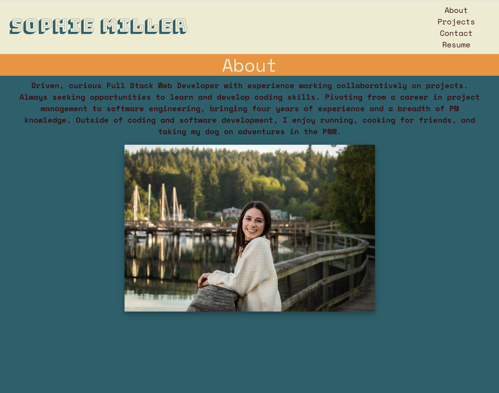

# React Portfolio

## Table of Contents

- [Description](#description)
- [Installation](#installation)
- [Usage](#usage)
- [Contributing](#contributing)
- [Tests](#tests)
- [License](#license)
- [Questions](#questions)

## Description

A portfolio of my work and professional experience built using React.

## Installation

There are no installation instructions. Simply follow this [link](ttps://millersg47.github.io/React-Portfolio/) to view the application in a web browser.

## Usage

The use case for this project is to showcase my full stack developer skills to potential employers.

## Contributing

N/A

## Tests

There are no tests for this application.

## License

    MIT

## Questions

- [GitHub profile](https://github.com/millersg47)
- Contact Me at millersg47@gmail.com with additional questions
